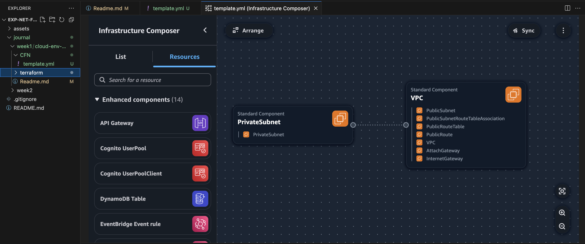

## Install AWS CLI

https://docs.aws.amazon.com/cli/latest/userguide/getting-started-install.html

## Configure AWS Credentials

Authenticated with your aws account:

""aws configure""

## Configure AWS Credentials

Note: Your must create a user with access keys.

### Configure aws

Authenticated with your aws account:

aws configure

Provide your:
	•	AWS Access Key ID
	•	AWS Secret Access Key
	•	Region (e.g. eu-central-1)
	•	Output format (you can leave blank or use json)

### Create the S3 Bucket

Ensure the bucket name is globally unique.

aws s3api create-bucket \
  --bucket network-bootcamp-tfstate-david-tausend \
  --region eu-central-1 \
  --create-bucket-configuration LocationConstraint=eu-central-1

### Create a DynamoDB Table

For state locking (avoids simultaneous edits):

aws dynamodb create-table \
  --table-name terraform-locks \
  --attribute-definitions AttributeName=LockID,AttributeType=S \
  --key-schema AttributeName=LockID,KeyType=HASH \
  --billing-mode PAY_PER_REQUEST
   

### Add a backend block in backend.tf

terraform {
  backend "s3" {
    bucket         = "network-bootcamp-tfstate-<your-unique-suffix>"
    key            = "vpc/terraform.tfstate"
    region         = "eu-central-1"
    dynamodb_table = "terraform-locks"
    encrypt        = true
  }
}

### Reinitialize Terraform

terraform init

### To Convert .pem → .ppk

puttygen nwbootcampkey-ppk-raw.pem -o nwbootcampkey-ppk.ppk

## VPC Settings

There are the VPC Settings we observed Tim setup for our cloud environment in AWS:

 -VPC IPv4 CIDR Block: 10.200.123.0/24
 -Ipv6 CIRD Block: NO
 -Number of Azs: 1
 -Number of public subnets: 1
 -Number of private subnets: 1
 -NAT GATEWAY: None
 -VPC Endpoints: None
 -DNS Options: enable DNS Hostnames

## Generated and Review CFN Template

The CloudFormation template was generated using an LLM (ChatGPT) based on the instructor’s specifications.

## Gegerated Deploy Script

Using ChatGPT generated a bash script 'bin/deplpy'.

Note: Make sure to run chmod +x bin/deploy to make it executable.

## Visualization in Infrastructure Composer

## Deploy CFN

 aws cloudformation create-stack \
  --stack-name my-vpc-stack \
  --template-body file://vpc-template.yaml \
  --parameters \
      ParameterKey=AvailabilityZone,ParameterValue=eu-central-1a

## Issues

### Content review

I didn't review the complete videos or content, so 

